# Control Center Target Architecture

## 1. Purpose

本文档定义 `red-code` 从“本地 CLI Agent”演进为“独立客户端 + 常驻后端服务 + 实时控制台”的目标架构。

它不是当前实现说明，也不是纯产品愿景文档，而是下一阶段工程实现的目标态设计。本文档用于约束以下决策：

- 后端继续以 Python runtime 为核心
- 首个 GUI 版本优先采用独立桌面客户端
- 实时交互采用 WebSocket
- 查询与管理接口采用 HTTP
- 首版继续使用 SQLite + 本地文件持久化
- 目标形态接近单用户版 `Cobalt Strike`/控制台，而不是简单聊天网页

## 架构修订：Session 不再绑定目标

Control Center 的 Session 是 Agent 对话与执行上下文，不是单台靶机或单个 URL 的绑定对象。Session 创建不接收操作员输入的名称或描述；系统从 Session 表的 UUID 派生 16 位可见标识，首条操作员消息到达后再作为 Session 标题展示。Session 不会保存 `target_value`、`target_type` 或 `target_id`。

Target 只存在于 Project Target Pool，并通过 Project scope policy 管理 active / pending / rejected / archived 状态。所有扫描任务必须显式引用 Target Pool 中 active 的 `target_id`；Agent 对新目标的流程必须是 `propose_target(value)` -> 准入结果 -> active 后调用扫描工具。pending、rejected 或超出 Project scope 的目标不得直接扫描。

## 2. Product Shape

目标产品由三部分组成：

- `Desktop Client`
  - 独立桌面客户端
  - 面向操作者的 GUI 控制台
- `App Server`
  - 常驻后端服务
  - 暴露 HTTP 与 WebSocket
- `Runtime and Storage`
  - 执行引擎、后台任务、持久化与结果管理

### 2.1 目标体验

用户可以：

- 启动本地后端或连接远程后端
- 从桌面客户端创建/恢复 session
- 在 GUI 中发起普通任务或 redteam 任务
- 实时查看执行进度、确认请求、结果产物与 findings
- 在客户端断开后让后端继续执行后台任务
- 重新连接后恢复 session 视图与历史状态

### 2.2 v1 边界

v1 固定为：

- 单用户
- 可本地部署，也可远程部署
- 单节点 App Server
- 单节点 worker
- 本地优先持久化
- 桌面客户端优先

v1 不做：

- 多用户协作
- 多租户
- 分布式 worker 集群
- 浏览器端优先产品
- 将 Python runtime 重写为 Node/TypeScript

## 3. Top-Level Architecture

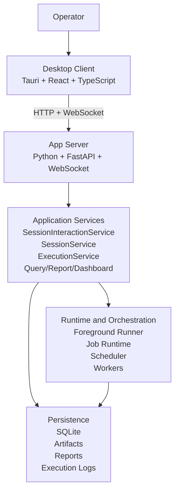

关键原则：

- 客户端只负责交互、展示与连接管理
- App Server 负责协议、会话、路由与服务组合
- Application Services 负责业务规则，不承担传输细节
- Runtime 负责执行与调度
- Storage 负责状态与结果持久化

## 4. Reuse from Current Repository

当前仓库已经存在一批可直接复用为服务化基础的模块：

- `src/app/session_interaction_service.py`
- `src/app/execution_service.py`
- `src/app/session_service.py`
- `src/app/session_record_query_service.py`
- `src/app/report_flow_service.py`
- `src/app/dashboard_service.py`
- `src/app/interaction_port.py`
- `src/models/conversation_context.py`
- `src/web/contracts.py`
- `src/web/serialization.py`
- `src/web/interaction_adapter.py`

这些模块说明当前仓库已经完成了：

- conversation state 抽取
- controller 与 execution 的共享交互层
- Web DTO 与 serialization 边界
- 查询与报告服务边界
- execution progress / confirmation 的事件化表达

因此目标架构不是从零重写，而是把现有 runtime 从“CLI 为主的进程内应用”演进为“常驻服务 + 独立客户端”。

## 5. Desktop Client Architecture

### 5.1 固定技术选择

桌面客户端 v1 固定采用：

- `Tauri`
- `React`
- `TypeScript`
- `Vite`

说明：

- `Tauri` 负责桌面壳、系统集成、窗口、托盘、配置文件与打包
- `React + TypeScript` 负责 UI、状态和协议类型
- `Vite` 作为桌面优先前端构建方案
- `Next.js` 不作为桌面客户端 v1 的基础框架；如未来补浏览器端，再单独增加 `Next.js` Web app

### 5.2 客户端模块图

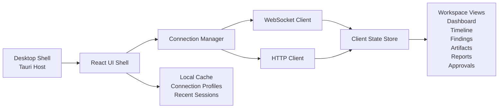

### 5.3 客户端职责

客户端负责：

- 连接配置管理
- WebSocket/HTTP 通信
- 当前 workspace 视图切换
- 实时事件渲染
- approval/clarification 交互
- 本地 UI 状态与少量缓存

客户端不负责：

- 执行业务逻辑
- 风险判定
- 工具执行
- session 真正持久化
- 生成 findings/reports

## 6. App Server Architecture

### 6.1 分层图

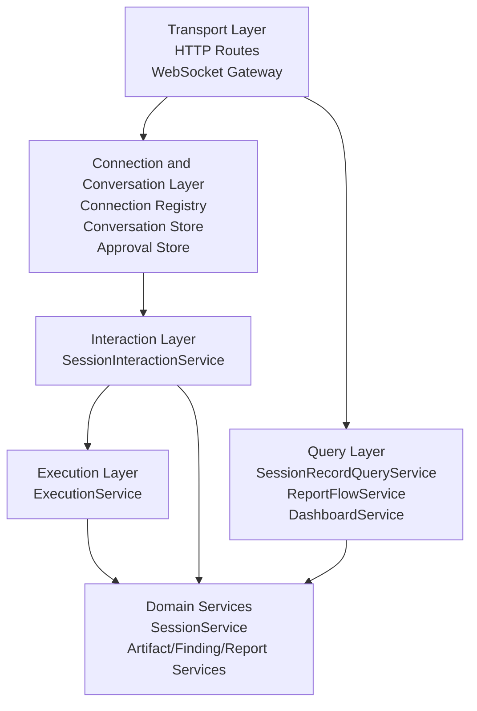

### 6.2 App Server 职责

App Server 负责：

- HTTP 和 WebSocket 暴露
- 连接与 conversation 管理
- 把客户端消息路由到 `SessionInteractionService`
- 把 execution progress/confirmation 转换为实时事件
- 暴露 session/history/artifact/finding/report/dashboard 查询接口
- 管理 approval pending state
- 管理 reconnect/resume
- 记录 operator 级审计

App Server 不负责：

- 直接实现控制器决策
- 直接实现工具执行
- 直接绕过 service 层访问 repository 完成主业务

### 6.3 服务入口

长期服务入口不再是 `src/main.py`。

新的服务组合根应位于：

- `src/server/app.py`

建议子模块：

- `src/server/dependencies.py`
- `src/server/routes/`
- `src/server/ws.py`
- `src/server/auth.py`
- `src/server/lifecycle.py`

## 7. Runtime and Worker Architecture

### 7.1 执行模型图

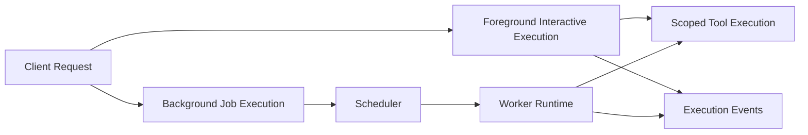

### 7.2 固定执行边界

系统固定支持两类执行：

- `foreground interactive execution`
  - 绑定当前 conversation
  - 实时回显
  - 可中途等待 confirmation
- `background job execution`
  - 绑定 session
  - 不要求客户端持续在线
  - 可重连后恢复查看

### 7.3 v1 运行方式

v1 固定为：

- App Server 单进程
- worker 与 scheduler 可在同进程内运行
- 不引入分布式消息队列
- detached/background 执行使用当前 runtime/orchestration 能力逐步接入

## 8. Persistence and Data Model

### 8.1 持久化分层

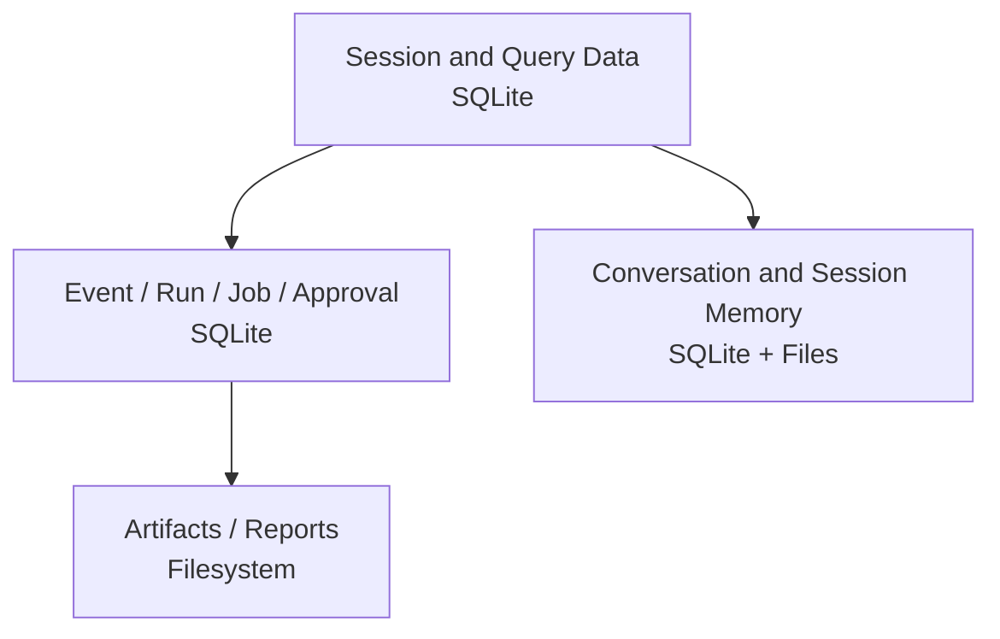

### 8.2 数据关系图

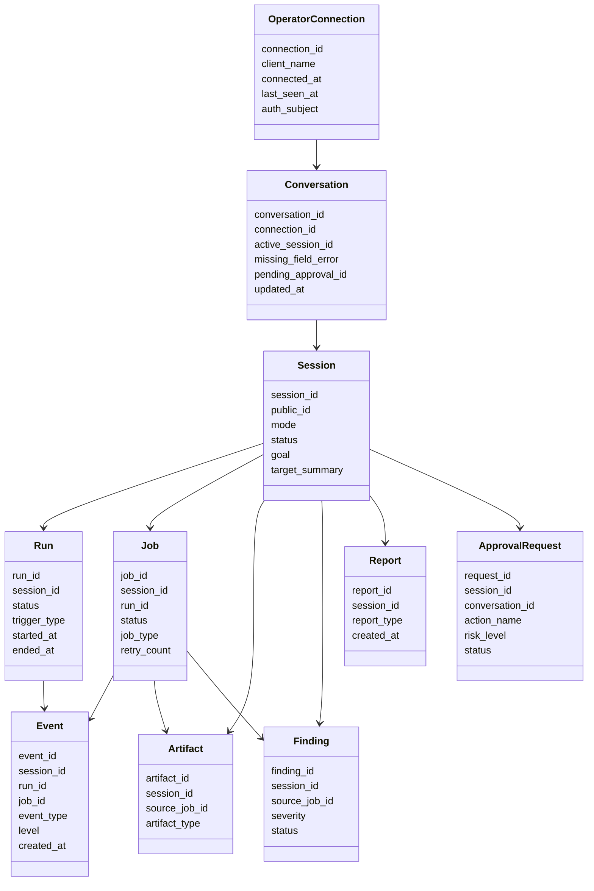

### 8.3 模型职责

- `OperatorConnection`
  - 客户端连接层对象
  - 不等同于业务 session
- `Conversation`
  - 交互状态对象
  - 保存当前绑定 session 和 pending approval
  - 缺字段场景通过 `missing_field_error` 返回给前端表单，不保存 conversation-level pending clarification
- `Session`
  - 顶层业务容器
  - 用户真正操作和检索的对象
- `Run`
  - 一次完整执行实例
- `Job`
  - 后台执行单元
- `Event`
  - 实时大屏、时间线、审计、重放的统一事实来源
- `ApprovalRequest`
  - 后端确认请求对象
  - 不由客户端本地状态单独决定

## 9. Protocol Architecture

### 9.1 HTTP vs WebSocket 职责图

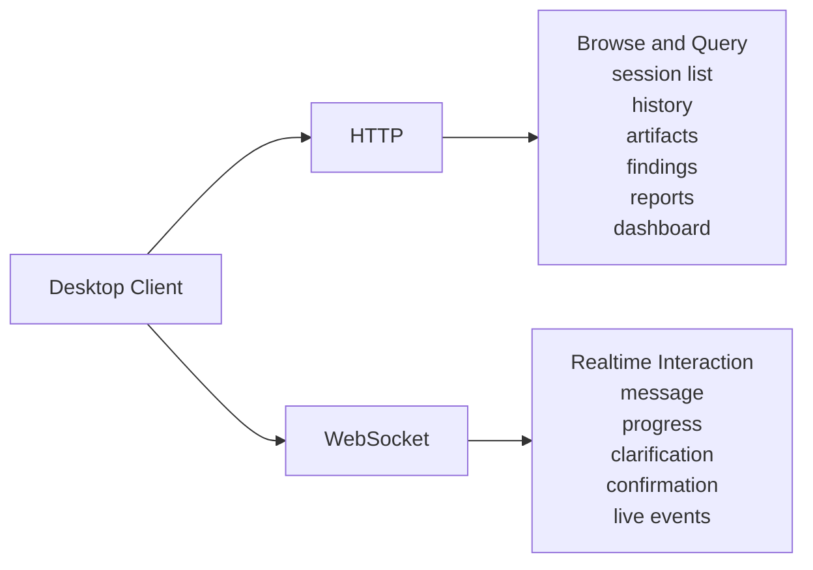

### 9.2 HTTP 接口族

HTTP 负责：

- 列表与详情查询
- dashboard 聚合
- report 生成与下载
- artifact 下载
- 连接信息与健康检查
- 管理型命令

建议 endpoint families：

- `POST /api/connections`
- `GET /api/health`
- `GET /api/sessions`
- `GET /api/sessions/{session_identifier}`
- `GET /api/sessions/{session_identifier}/history`
- `GET /api/sessions/{session_identifier}/steps`
- `GET /api/sessions/{session_identifier}/artifacts`
- `GET /api/sessions/{session_identifier}/findings`
- `GET /api/sessions/{session_identifier}/reports`
- `GET /api/sessions/{session_identifier}/dashboard`
- `POST /api/sessions/{session_identifier}/reports`
- `GET /api/approvals`
- `POST /api/runs/{run_id}/cancel`

### 9.3 WebSocket 消息族

```mermaid
graph TD
    WS[WebSocket Channel]
    ClientToServer[Client -> Server]
    ServerToClient[Server -> Client]

    WS --> ClientToServer
    WS --> ServerToClient

    ClientToServer --> C1[conversation.message]
    ClientToServer --> C2[conversation.answer_clarification]
    ClientToServer --> C3[conversation.confirmation]
    ClientToServer --> C4[conversation.cancel_run]
    ClientToServer --> C5[session.bind]
    ClientToServer --> C6[session.unbind]

    ServerToClient --> S1[controller.result]
    ServerToClient --> S2[execution.progress]
    ServerToClient --> S3[clarification.required]
    ServerToClient --> S4[confirmation.required]
    ServerToClient --> S5[confirmation.resolved]
    ServerToClient --> S6[artifact.created]
    ServerToClient --> S7[finding.created]
    ServerToClient --> S8[report.created]
    ServerToClient --> S9[run.completed]
    ServerToClient --> S10[run.failed]
```

### 9.4 协议原则

- 一个 `conversation_id` 对应一个实时交互上下文
- 一个连接可拥有多个 conversation，但 v1 默认主工作区只有一个活跃 conversation
- 所有 server-to-client 事件必须带：
  - `conversation_id`
  - `sequence`
  - `timestamp`
  - `event_kind`
- confirmation 的最终裁决由后端状态机记录，不由客户端 UI 单独持有

## 10. Desktop Information Architecture

### 10.1 页面结构图

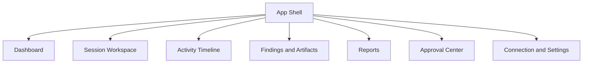

### 10.2 Session Workspace 布局草图

```text
+----------------------------------------------------------------------------------+
| Top Bar: connection status | active server | active session | risk queue | user |
+----------------------+--------------------------------------+-------------------+
| Left Nav             | Center Workspace                     | Right Inspector   |
| - sessions           | - conversation stream               | - session summary |
| - targets            | - live execution timeline           | - scope/policy    |
| - jobs               | - inline clarification/approval     | - current finding |
| - reports            | - command/input composer            | - recent artifacts|
+----------------------+--------------------------------------+-------------------+
| Bottom Status: websocket state | active run | pending approval | event lag        |
+----------------------------------------------------------------------------------+
```

### 10.3 各视图职责

- `Dashboard`
  - 全局状态墙
  - 活跃 session、run、job、finding、report 统计
- `Session Workspace`
  - 主交互界面
  - conversation、progress、approval 一体化
- `Activity Timeline`
  - 专注实时事件与历史事件回放
- `Findings and Artifacts`
  - 结构化结果浏览与追踪
- `Reports`
  - 报告列表、生成、下载
- `Approval Center`
  - 所有待确认动作的统一入口

## 11. Deployment Topologies

### 11.1 本地单机模式

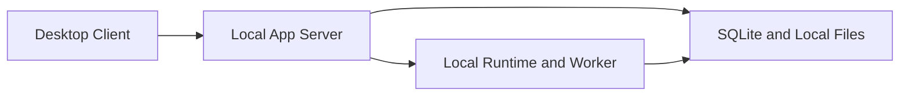

适用：

- 个人开发
- 本机测试
- 本地优先部署

连接模型：

- `Desktop Client` 是 Tauri + React 客户端，不直接承载 Python runtime。
- `Local App Server` 是 FastAPI 进程，负责 HTTP API、WebSocket、任务调度和服务组合。
- 客户端默认连接 `http://127.0.0.1:<port>`，并提供运行时 backend URL 配置；运行时配置优先于构建期 `VITE_BACKEND_URL`。
- 事件流默认由同一 backend URL 派生为 `ws://127.0.0.1:<port>/ws/events`；启用认证时 WebSocket 使用 `auth_token=<token>` 查询参数。
- 扫描、Agent 执行、报告生成、SQLite 和本地文件读写全部发生在本机 App Server 侧。
- packaged desktop app 可以连接已经运行的本地 App Server；是否由桌面壳自动启动本地 sidecar 是打包层能力，不改变 client/server 边界。

### 11.2 远程单机模式

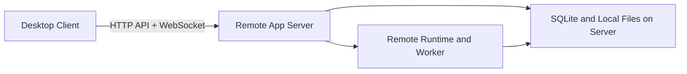

适用：

- 单用户远程控制
- 客户端与执行环境分离
- 后台任务在服务端持续运行

连接模型：

- 本地机器只运行 `Desktop Client`。
- 远程服务器运行 `Remote App Server`、runtime/worker、SQLite 和项目文件目录。
- 客户端通过配置的 backend URL 调用 HTTP JSON API，并从同一 URL 派生 WebSocket 事件与交互流。
- 所有具有副作用的能力，包括扫描、文件访问、报告生成和证据落盘，都在远程服务器执行。
- 客户端不得假设本地文件系统拥有远程 artifact；下载、预览和打开报告必须通过服务端 API 或经过明确授权的文件传输机制。

远程模式连接要求：

- App Server 默认仍只绑定 `127.0.0.1`；绑定 `0.0.0.0` 或公网地址属于显式运行配置。
- HTTP API 和 WebSocket 都从客户端选择的 backend URL 派生，确保请求与事件回放连接到同一个 App Server。
- `.red-code/config/control-center-auth.json` 提供可选的单用户认证；缺失或禁用时，远程和本地开发模式都保持未认证。
- 服务端 data dir、工具路径、wordlist、nuclei templates 和 artifact root 必须以服务端配置为准。
- 远程 server 本质上是执行环境；扫描、报告和 artifact 都以服务端状态为准。

### 11.3 统一程序入口和运行模式

目标产品可以提供统一 launcher，但运行时边界仍保持 client/server 分离。

推荐命令形态：

```bash
red-code server --host 127.0.0.1 --port 8000
red-code server --host 0.0.0.0 --port 8000 --config ./server.toml
red-code client --backend-url http://red-agent.example.com:8000
red-code desktop
```

语义：

- `red-code server` 只启动 App Server，不启动桌面 UI。
- `red-code client` 只启动客户端，并连接显式指定的 backend URL。
- `red-code desktop` 面向本地 all-in-one 使用场景，可以先启动或发现本地 App Server，再启动桌面客户端。
- packaged Tauri app 应提供运行时 backend URL 配置；不能只依赖构建期 `VITE_BACKEND_URL`。
- 统一入口只负责进程编排和配置传递，不把 Python 后端和前端 UI 合并成一个业务进程。

### 11.4 v1 不支持的部署

v1 不支持：

- 多 App Server 集群
- 多 worker 节点调度
- 多用户共享控制台
- 云对象存储和数据库拆分部署作为必需能力

## 12. Fixed Technology Decisions

本文档冻结以下技术与工程决策：

- 后端语言：`Python`
- 服务框架：`FastAPI`
- 实时通信：`WebSocket`
- 查询接口：`HTTP JSON`
- 桌面壳：`Tauri`
- UI 框架：`React + TypeScript`
- 桌面前端构建：`Vite`
- 持久化：`SQLite + local filesystem`

不采用：

- 将后端整体迁移到 Node/TypeScript
- 把 Next.js 作为桌面客户端基础
- 用 polling 代替主要实时交互
- 在 v1 引入 PostgreSQL/object storage 作为强依赖

## 13. Security and Audit Boundaries

即使是单用户版，系统也必须保留：

- 后端认证壳
- 连接审计
- confirmation 审计
- run/job/event 审计
- artifact/report 导出审计
- scope 与 risk policy 的后端裁决权

权限模型在 v1 固定为单用户，不展开角色体系；但服务设计必须保留未来增加：

- `viewer`
- `operator`
- `approver`
- `admin`

的扩展余地。

## 14. Implementation Meaning

本文档的含义不是“把现有 CLI UI 换成 GUI”。

真正的目标是：

- 把 Python agent runtime 提升为常驻 App Server
- 把 conversation/execution/query/report/dashboard 能力服务化
- 把桌面客户端做成独立控制台
- 让后端在客户端断开后仍可继续执行
- 让时间线、结果、报告和确认动作成为统一控制面的一部分

这就是 `red-code` 的 Control Center 目标态。
