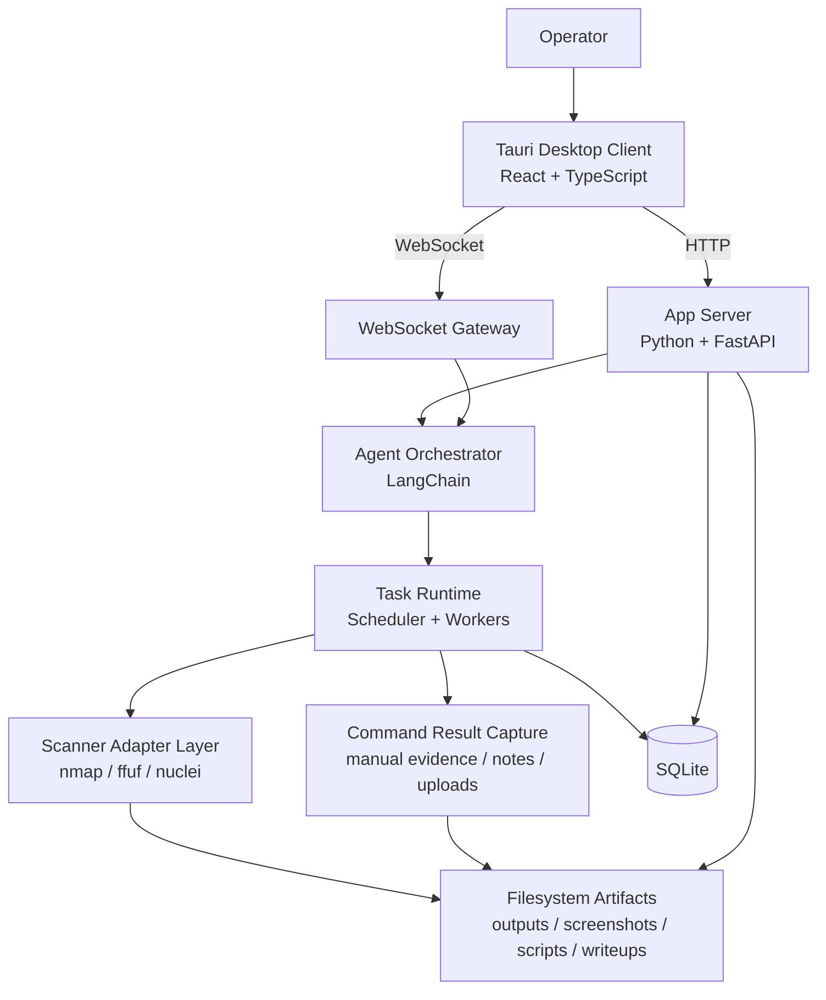
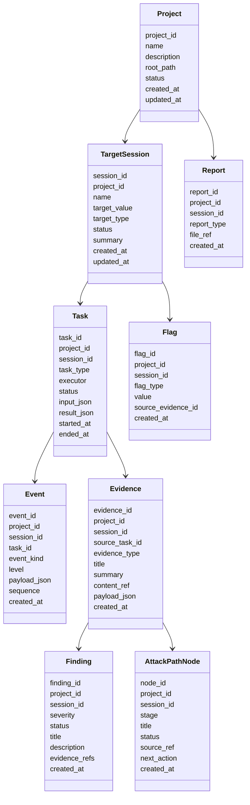
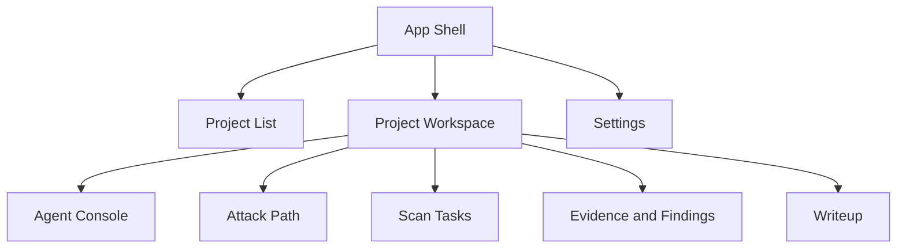

# CTF Control Center Platform Design

## 1. Purpose

本文档定义 `red-code` 面向 CTF 靶场控制平台的目标设计。它基于现有 Python Agent 与 control-center 架构方向，但产品目标收敛为个人 CTF 靶场高效率工作台。

本文档回答：

- 系统由哪些子系统组成
- UI、API、Agent、扫描器、外部命令结果采集和存储如何协作
- Project、Session、Task、Evidence、Attack Path 如何建模
- `nmap`、`ffuf`、`nuclei` 如何通过统一执行层接入
- 实时事件和报告如何从运行时流向桌面端

## Architecture Revision: Session 与 Target Pool

当前 Control Center 架构中，Session 是 Agent 对话与执行上下文，不再是目标绑定实体。创建 Session 只需要 `name` 和可选 `summary`；公开 API/DTO 不暴露 `target_value`、`target_type` 或 `target_id`。

Target 只存在于 Project Target Pool，并由 scope policy 约束。扫描器和 Agent 工具必须显式使用 Target Pool 中 active 的 `target_id`；新发现目标必须先通过 `propose_target(value)` 进入准入流程，pending/rejected/out-of-scope 目标不得直接扫描。本文档后续早期草图中的 `TargetSession` 字样应按该修订理解为 “Session + Project Target Pool” 的组合边界，而不是单个目标绑定 Session。

## 2. Top-Level Architecture



核心原则：

- 桌面端负责交互、展示、连接和本地用户体验。
- 后端负责业务状态、Agent 编排、任务调度、工具调用和持久化。
- Agent 不直接执行 shell 字符串扫描，必须通过 Scanner Adapter。
- Scanner Adapter 输出结构化结果，同时保存原始输出。
- 外部命令执行发生在系统外部；v1 只负责建议、结果整理与证据归档。
- SQLite 是 v1 结构化事实来源，文件系统保存大对象和原始材料。

## 3. Repository Shape

推荐目标目录：

```text
src/
  server/
    app.py
    dependencies.py
    lifecycle.py
    ws.py
    routes/
      health.py
      projects.py
      sessions.py
      tasks.py
      evidence.py
      findings.py
      reports.py
  app/
    project_service.py
    target_session_service.py
    attack_path_service.py
    scanner_service.py
    ctf_agent_service.py
    writeup_service.py
  scanners/
    contracts.py
    registry.py
    nmap_adapter.py
    ffuf_adapter.py
    nuclei_adapter.py
    process_runner.py
    parsers/
  storage/
    repositories/
  web/
    contracts.py
    serialization.py

desktop-client/
  src/
    app/
    features/
      projects/
      workspace/
      agent-console/
      attack-path/
      scans/
      evidence/
      writeup/
      settings/
    lib/
      api/
      ws/
      state/
      types/
  src-tauri/
```

Existing modules under `src/app`, `src/web`, `src/storage`, and `src/orchestration` should be reused where they fit, but new CTF-specific concepts should not be forced into legacy task/operation names.

## 4. Domain Model

### 4.1 Relationship Overview



### 4.2 Entity Responsibilities

- `Project`
  - 顶层靶场容器
  - 管理多个目标 Session
  - 拥有 Project 级文件目录和 writeup
- `TargetSession`
  - 单台靶机或单个目标上下文
  - 绑定 target scope、攻击路径、任务和证据
- `Task`
  - 所有自动扫描、Agent 分析和报告生成的执行事实
  - 不承载 UI 临时状态
- `Event`
  - 实时 UI、审计、恢复和时间线的统一事实
- `Evidence`
  - 结构化结果和原始材料之间的索引
  - 每条 evidence 必须可追溯到任务或用户手动输入
- `Finding`
  - 已整理的线索、漏洞假设或验证结论
- `AttackPathNode`
  - 攻击路径视图的基本单位
  - 可以来自 Task、Evidence、Finding、Flag 或用户手动创建
- `Flag`
  - CTF 成果记录
  - 值可以选择遮蔽显示，但本地存储保留原文
- `Report`
  - Markdown writeup 或结构化导出文件索引

## 5. Desktop Client Design

### 5.1 Information Architecture



### 5.2 Workspace Layout

主工作区采用三栏结构：

- 左侧：Project / Session 导航、目标摘要、任务队列
- 中间：Agent Chat、实时工具调用、扫描进度、命令建议
- 右侧：攻击路径、证据、flag、下一步建议、writeup 摘要

推荐最终布局采用 `Attack Decision Cockpit` 方案：

- 顶栏
  - 展示 Project、Session、目标范围、后端连接状态和全局搜索
  - 提供 `Recon`、`Exploit`、`Report` 模式切换
  - 展示 `Risk Score` 和 `Critical Path`
- 左侧操作栏
  - 保留 Project / Session 导航
  - 展示当前目标摘要
  - 展示任务队列、运行中数量、排队数量、工具状态、基础 ETA
- 中央决策区
  - 顶部固定 `Agent Loop`，展示 `Plan -> Act -> Observe -> Reflect`
  - 展示当前阶段、迭代次数和是否正在收敛
  - Agent Console 不只显示聊天文本，还要显示 tool call cards、task progress cards、decision summary、next command suggestion
  - 底部采用 `Scans / Evidence Intake` 切换或上下分区，保证工具结果与外部命令结果整理入口始终可达
- 右侧情报栏
  - 顶部固定 `Attack Reasoning Panel`
  - 中部展示双层 `Attack Graph`
  - 下部展示 `Structured Evidence`、`Flags / Loot`、`Writeup Progress`

`Attack Decision Cockpit` 的目标不是堆叠工具面板，而是把 Agent 的判断过程显式化。UI 必须优先回答：

- 当前 Agent 为什么做这个动作
- 这个建议来自哪些证据和发现
- 当前攻击路径走到了哪一步
- 下一步动作的置信度和策略是什么

推荐视觉层级：

- 中央 Agent 决策区是默认视觉焦点
- 右侧推理与攻击图是次焦点，但必须始终可见
- 左侧导航和任务区密度可以高，但不应抢占主视线

推荐信息模型：

- `Attack Reasoning`
  - 展示由服务、证据、finding 推导出的推理链
  - 每条建议可包含 `confidence`、`strategy`、`why this next`
- `Attack Graph`
  - 同时保留操作级节点和阶段级标签
  - 示例：`Nmap Scan -> Found SMB 445 -> Anonymous Shares -> Credential Candidate -> SSH Login`
  - 阶段标签可映射 `recon`、`service-enum`、`web-enum`、`poc-verified` 等抽象阶段
- `Structured Evidence`
  - 默认不是文件列表视图
  - 应优先按 `Credentials`、`Services`、`Vulns`、`Files` 分类展示
  - 原始 artifact 作为 drill-down 明细，而不是首页主视图

设计要求：

- 扫描任务必须可见，不隐藏在聊天文本中。
- Agent 工具调用必须有结构化卡片。
- 攻击路径节点必须能展开查看证据。
- 外部命令结果必须可整理为 evidence。
- UI 必须支持在 Project、Session 和 Task 之间快速跳转。
- Agent Console 必须展示 reasoning，而不是只展示 tool log。
- Attack Path 必须支持从抽象阶段视图切换到操作级 attack graph。
- Evidence 首页必须优先展示结构化情报，而不是原始文件树。
- Workspace 必须支持 `Recon`、`Exploit`、`Report` 模式切换，避免所有信息同时争抢注意力。

### 5.3 Client State

客户端本地状态只保存：

- 当前连接配置
- 最近打开 Project
- 当前选中 Session
- UI 面板布局
- WebSocket 连接状态
- 未提交输入内容

业务事实必须以后端和 SQLite 为准。

## 6. App Server Design

### 6.1 Responsibilities

App Server 负责：

- HTTP API
- WebSocket Gateway
- Project / Session 服务组合
- Agent 消息路由
- Task 调度
- Scanner Adapter 调用
- Evidence / Finding / Attack Path 生成
- Writeup 生成
- Artifact 下载

App Server 不负责：

- 在路由层直接实现扫描解析
- 绕过 service 层直接写复杂业务状态
- 让客户端决定任务终态

### 6.2 HTTP API Families

v1 HTTP 接口族：

```text
GET    /api/health

GET    /api/projects
POST   /api/projects
GET    /api/projects/{project_id}
PATCH  /api/projects/{project_id}

GET    /api/projects/{project_id}/sessions
POST   /api/projects/{project_id}/sessions
GET    /api/sessions/{session_id}
PATCH  /api/sessions/{session_id}

GET    /api/sessions/{session_id}/dashboard
GET    /api/sessions/{session_id}/attack-path
POST   /api/sessions/{session_id}/attack-path

GET    /api/sessions/{session_id}/tasks
POST   /api/sessions/{session_id}/tasks
POST   /api/tasks/{task_id}/cancel
POST   /api/tasks/{task_id}/rerun

GET    /api/sessions/{session_id}/evidence
POST   /api/sessions/{session_id}/evidence
GET    /api/evidence/{evidence_id}

GET    /api/sessions/{session_id}/findings
PATCH  /api/findings/{finding_id}

GET    /api/sessions/{session_id}/flags
POST   /api/sessions/{session_id}/flags

GET    /api/sessions/{session_id}/reports
POST   /api/sessions/{session_id}/reports
GET    /api/projects/{project_id}/reports
POST   /api/projects/{project_id}/reports
GET    /api/reports/{report_id}/download

GET    /api/tools/status
GET    /api/tools/config
PATCH  /api/tools/config
```

### 6.3 WebSocket Message Families

WebSocket 负责实时交互和实时事件。

Client to Server:

```text
conversation.message
conversation.cancel
session.bind
session.unbind
task.start
task.cancel
evidence.create_from_selection
```

Server to Client:

```text
conversation.delta
conversation.completed
agent.tool_call.started
agent.tool_call.completed
task.queued
task.started
task.progress
task.completed
task.failed
scanner.output
evidence.created
finding.created
attack_path.node_created
attack_path.node_updated
flag.created
report.created
error
```

Every server event must include:

- `event_id`
- `project_id`
- `session_id`
- `task_id` when available
- `sequence`
- `event_kind`
- `timestamp`
- `payload`

## 7. Agent Orchestrator Design

### 7.1 Responsibilities

Agent Orchestrator 负责：

- 理解用户输入
- 读取当前 Project / Session / Attack Path 上下文
- 制定枚举计划
- 调用任务服务创建扫描任务
- 分析扫描结果
- 生成 finding 和下一步建议
- 生成命令建议
- 生成 writeup 草稿

### 7.2 Agent Context

每次 Agent turn 至少包含：

- 当前 Project 摘要
- 当前 Session 目标
- 最近事件
- 开放端口摘要
- Web 资产摘要
- POC 命中摘要
- 攻击路径当前节点
- 最近命令摘要
- 已记录 flag/loot
- 可用工具和限制

### 7.3 Agent Tool Surface

Agent 可调用的高层工具：

- `create_project`
- `create_target_session`
- `start_port_scan`
- `start_dir_scan`
- `start_poc_scan`
- `summarize_task_result`
- `create_attack_path_node`
- `create_finding`
- `suggest_command`
- `create_writeup_draft`

Agent 不直接调用：

- 原始 `bash`
- 任意 shell 字符串扫描
- 未注册外部工具

命令由 Agent 建议，用户在系统外部执行。

## 8. Scanner Adapter Design

### 8.1 Contract

统一扫描器接口：

```text
ScannerRequest
  request_id
  project_id
  session_id
  scanner_name
  target
  options
  output_dir

ScannerResult
  request_id
  scanner_name
  status
  summary
  findings
  evidence
  raw_output_refs
  started_at
  ended_at
  error
```

Adapter 必须：

- 校验目标属于 Session
- 构造安全参数列表
- 启动外部进程
- 流式读取 stdout/stderr
- 保存原始输出
- 解析结构化结果
- 生成 evidence candidates
- 返回明确错误

Adapter 不允许：

- 拼接未转义 shell 字符串
- 把 stdout 当作唯一结果
- 失败时吞掉原始输出

### 8.2 nmap Adapter

职责：

- 执行端口扫描和服务识别
- 默认生成 XML 输出
- 解析开放端口、协议、服务、版本、脚本输出

推荐命令形态：

```text
nmap -sV -oX <xml_output> <target>
```

可配置选项：

- port range
- scan timing
- service detection
- scripts
- retries
- timeout

输出：

- open ports
- service fingerprints
- host status
- evidence: raw XML、stdout、解析 JSON

### 8.3 ffuf Adapter

职责：

- 对 HTTP/HTTPS 目标执行目录和路径发现
- 使用 JSON 输出
- 过滤噪声状态码和响应大小

推荐命令形态：

```text
ffuf -u <base_url>/FUZZ -w <wordlist> -of json -o <json_output>
```

可配置选项：

- wordlist
- extensions
- status filters
- size filters
- rate
- recursion
- headers

输出：

- discovered paths
- status code
- response size
- redirect location
- content words/lines
- evidence: raw JSON、stdout、解析 JSON

### 8.4 nuclei Adapter

职责：

- 对候选 URL 或服务执行模板验证
- 保存 JSONL 输出
- 将命中结果转为 finding 和 evidence

推荐命令形态：

```text
nuclei -target <target> -jsonl -o <jsonl_output>
```

可配置选项：

- templates
- tags
- severity
- rate limit
- interactsh enabled/disabled
- headers

输出：

- template id
- name
- severity
- matched URL
- extracted results
- curl command when available
- evidence: raw JSONL、stdout、解析 JSON

## 9. External Command Result Capture

### 9.1 Responsibilities

v1 不提供内置交互终端。

系统只负责：

- 展示 Agent 命令建议
- 接收用户手动整理的命令结果、文本摘录、文件与截图
- 将这些材料保存为 artifact 与 evidence
- 把命令结果与 finding、attack path、writeup 建立关联

### 9.2 Evidence Expectations

与外部命令相关的 evidence 应尽量包含：

- command text when known
- execution context summary when known
- result excerpt or uploaded raw output
- operator note about why the command mattered
- linked attack path node or finding when applicable

## 10. Persistence Design

### 10.1 SQLite

SQLite 保存：

- projects
- target_sessions
- tasks
- events
- evidence
- findings
- attack_path_nodes
- flags
- reports
- tool_configs

所有表必须包含：

- stable primary key
- created_at
- updated_at where mutable
- project_id where applicable
- session_id where applicable

### 10.2 Filesystem

文件布局建议：

```text
.red-code/
  projects/
    <project_id>/
      project.json
      sessions/
        <session_id>/
          artifacts/
            scans/
            evidence/
          reports/
            writeup.md
          scripts/
          notes/
      reports/
```

文件系统保存：

- nmap XML
- ffuf JSON
- nuclei JSONL
- stdout/stderr
- screenshots
- user-uploaded files
- generated scripts
- Markdown writeups

SQLite 中保存文件引用和摘要。

## 11. Attack Path Generation

攻击路径生成规则：

- nmap 开放端口生成 service 节点。
- HTTP/HTTPS 服务生成 web-entry 节点。
- ffuf 发现的重要路径生成 web-enum 节点。
- nuclei 命中生成 poc-verified 节点。
- 用户保存外部命令结果可生成 manual-evidence 节点。
- flag 记录生成 flag 节点。
- Agent 分析可以生成 hypothesis 和 next-action 节点。

节点状态：

- `new`
- `investigating`
- `verified`
- `dismissed`
- `blocked`
- `done`

节点必须可追溯到 source ref。

## 12. Writeup Generation

Writeup Service 从结构化数据生成 Markdown。

输入：

- Project metadata
- Session metadata
- Attack path nodes
- Evidence summaries
- Findings
- Scanner Task argv
- Flags

输出：

- Session writeup
- Project writeup

生成规则：

- 不编造未记录步骤。
- 命令必须来自 Scanner Task `argv` 或用户明确录入到 evidence/notes 的命令文本。
- 事实性条目必须带 public id 引用；未知 public id 会导致生成失败。
- Command Log 中的命令必须匹配已记录的 evidence/notes 命令文本或 Scanner Task `argv`。
- 证据、finding、task、command、flag 引用可在桌面端跳转或高亮。
- 未完成事项写入 TODO。
- flag 默认保留原值，后续可增加遮蔽选项。

## 13. Error Handling

必须明确处理：

- 外部工具不存在
- 外部工具版本不兼容
- wordlist 不存在
- 模板目录不存在
- 扫描进程超时
- 扫描进程非零退出
- 输出文件缺失或不可解析
- WebSocket 断开
- 客户端重连

错误必须同时：

- 返回给 UI
- 记录 Event
- 保留可诊断原始输出

## 14. Security Boundary

v1 安全边界为轻量防误操作：

- Project / Session 声明目标范围。
- Scanner Adapter 只接受结构化参数。
- 执行外部工具时使用 argv list，不使用 shell 拼接。
- Agent 不直接获得任意 shell 执行工具。
- 命令建议仅供用户在系统外部自主执行。
- 危险命令在 UI 中标识。
- 所有扫描和命令执行都可追溯。

不设计：

- 多用户权限
- 企业审批
- 强制授权证明
- 远程多租户隔离

## 15. Cross-Platform Notes

目标支持 macOS、Linux、Windows。

必须注意：

- 外部工具路径可配置。
- 文件路径使用跨平台 API。
- 默认 wordlist 路径不能写死为 Linux 专用路径。
- Tauri shell 权限最小化配置。
- Windows、macOS、Linux 下的文件选择、结果导入和路径序列化需要单独测试。

## 16. Acceptance Criteria

设计落地后，系统必须能完成：

1. 创建 Project 和 Target Session。
2. 通过 Agent Chat 发起自动枚举。
3. 后端调用 nmap、ffuf、nuclei 并产生结构化结果。
4. WebSocket 实时推送任务状态和工具输出。
5. 攻击路径自动出现服务、Web、POC 和 flag 节点。
6. 用户能把外部命令结果、文件或笔记保存为 evidence。
7. 生成 Markdown writeup。
8. 重启客户端后恢复 Project 状态。
9. 外部工具缺失时展示明确错误。
